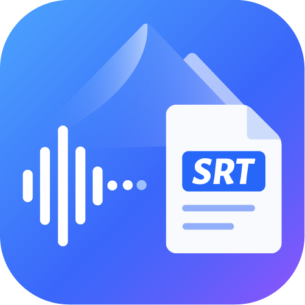
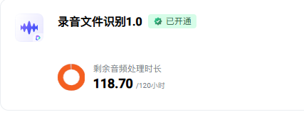

<p align="center">
  
</p>

<h1 align="center">Audio2SRT - 音频转字幕工具箱</h1>

<p align="center">
  <strong>基于火山引擎豆包语音识别 API 的音频转 SRT 字幕工具</strong>
</p>

<p align="center">
  <a href="https://www.python.org/downloads/"></a>
  <a href="https://github.com/naaive/origin/releases"></a>
  <a href="LICENSE"></a>
</p>

<p align="center">
  批量音频转写 · SRT 字幕优化 · Electron 桌面应用 · 支持本地文件与在线链接
</p>

---

## ✨ 功能特性

- **批量处理** - 一次添加多个音频/视频文件，自动转写生成 SRT 字幕
- **双模式支持** - 本地文件模式与在线链接模式，满足不同场景需求
- **视频音频提取** - 自动从视频文件中提取音频再进行识别
- **SRT 优化** - 智能断句、字幕长度控制、自动时间轴分配
- **拖拽操作** - 支持拖拽文件添加，操作更便捷
- **现代 UI** - 基于 Electron + React + Ant Design 的桌面应用
- **配置持久化** - 设置自动保存，无需重复配置

---

## 🚀 快速开始

### 环境要求

- Node.js 18 或更高版本
- Python 3.9 或更高版本
- Windows 10/11 操作系统

### 安装依赖

```bash
npm install
pip install -r requirements.txt
```

### 启动开发模式

```bash
npm run electron:dev
```

### 构建生产版本

```bash
npm run electron:build
```

打包好的安装包会在 `release/` 目录中。

---

## 📖 使用指南

### 音频转 SRT

1. 点击左侧"音频转 SRT"
2. 选择"本地文件"或"外链模式"
3. 添加音频/视频文件或输入 URL（每行一个）
4. 点击"开始处理"
5. 等待处理完成

**支持的音频格式**：MP3 / WAV / M4A / FLAC / AAC / OGG
**支持的视频格式**：MP4 / MKV / AVI / MOV / WMV / FLV / WEBM / M4V

### SRT 优化

1. 点击左侧"SRT 优化"
2. 选择需要优化的 SRT 字幕文件
3. 点击"开始优化"
4. 生成优化后的 `filename_opt.srt` 文件

**优化内容**：
- 自动按逗号断句
- 控制每行字幕长度（默认 25 字符）
- 自动分配时间轴
- 自动删除句号

### 设置

点击左侧"设置"页面配置以下参数：

| 配置项 | 说明 |
|--------|------|
| API Key | 火山引擎豆包语音 API 访问密钥 |
| Resource ID | 使用的资源 ID，默认 `volc.bigasr.auc` |

> 配置文件会自动保存为 `audio2srt_config.json`，位于用户数据目录中。

---

## 🔑 获取免费识别时长

1. 登录 [火山引擎控制台](https://console.volcengine.com/auth/login)
2. 进入 [授权使用页面](https://console.volcengine.com/speech/new/purchase?projectName=default)

3. 点击授权开通服务
4. [查看是否已开通录音文件识别1.0](https://console.volcengine.com/speech/new/setting/activate?projectName=default)

5. [找到api key 将其输入到应用的设置内保存](https://console.volcengine.com/speech/new/setting/apikeys?projectName=default)

---

## 📁 项目结构

```
audio2srt/
├── electron/              # Electron 主进程
│   ├── main.ts            # 主进程源码
│   └── preload.ts         # 预加载脚本
├── src/                   # React 前端
│   ├── components/        # 页面组件
│   ├── stores/            # 状态管理
│   ├── types/             # TypeScript 类型
│   ├── App.tsx
│   └── main.tsx
├── python_backend/        # Python 后端
│   ├── electron_bridge.py # Electron 桥接脚本
│   └── index.py           # 核心业务逻辑
├── image/                 # 图片资源
│   ├── ico.png            # 应用图标
│   ├── 授权.png           # 授权指引截图
│   └── 余量.png           # 余量查看截图
├── package.json
├── vite.config.ts
├── tsconfig.json
└── requirements.txt
```

---

## 🛠️ 技术栈

### 前端

| 组件 | 说明 |
|------|------|
| [Electron](https://www.electronjs.org/) | 桌面应用框架 |
| [React 18](https://react.dev/) | UI 框架 |
| [TypeScript](https://www.typescriptlang.org/) | 类型安全 |
| [Vite](https://vite.dev/) | 构建工具 |
| [Ant Design](https://ant.design/) | UI 组件库 |
| [Zustand](https://zustand-demo.pmnd.rs/) | 状态管理 |

### 后端

| 组件 | 说明 |
|------|------|
| [requests](https://requests.readthedocs.io/) | HTTP 请求库 |
| [moviepy](https://zulko.github.io/moviepy/) | 视频处理 |
| [pydub](https://github.com/jiaaro/pydub) | 音频处理 |
| 火山引擎 API | 语音识别服务 |

---

## ❓ 常见问题

**Q: 处理速度慢怎么办？**
A: 处理速度取决于网络状况和音频长度，请耐心等待。

**Q: 提示 API Key 无效？**
A: 请在火山引擎控制台检查 API Key 是否有效，然后在程序的"设置"页面更新。

**Q: 配置文件在哪里？**
A: `audio2srt_config.json` 位于系统用户数据目录中。

---

## 🤝 贡献

欢迎提交 Issue 和 Pull Request 来帮助改进项目！

---

## 📄 开源协议

本项目采用 MIT License 开源协议。

Copyright (c) 2026 Syie. All rights reserved.
